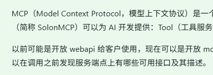

# flyMD 文本翻译插件

选中文本后显示按钮（或右键菜单），点击翻译按钮，将选中的文本翻译。翻译结果在文本旁浮动显示。

## 功能特性

- 🔄 **免费翻译服务**：使用 Microsoft/Google 翻译免费 API，无需配置 API Key
- 🌐 **两种触发方式**：可选设置"选中文本后自动显示按钮"或"放在右键菜单中"
- 📋 **显示模式可配置**：可选择在源码模式、所见模式、阅读模式下是否显示翻译按钮

## 安装方式

### 方式一：本地安装
下载插件，使用 flyMD 的插件管理器进行选择路径安装

### 方式二：通过扩展市场安装
在 flyMD 中找到"文本选择翻译"插件，点击"安装"

## 注意事项

- 需要网络连接才能使用翻译功能
- 翻译 API 可能有频率限制
- 如使用右键菜单模式，请检查「扩展菜单管理」中的「右键菜单」选项是否已勾选。

## Unresolved
- 多语言动态切换
- 不同模式下翻译按钮显示位置偏差
- 源码模式下选择文本并切换模式时，按钮会异常显示，可在切换前取消文本选择状态